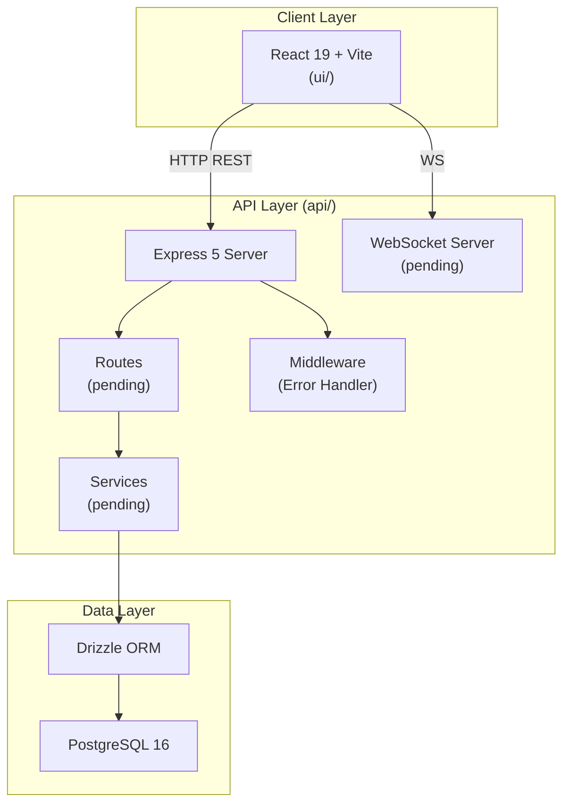
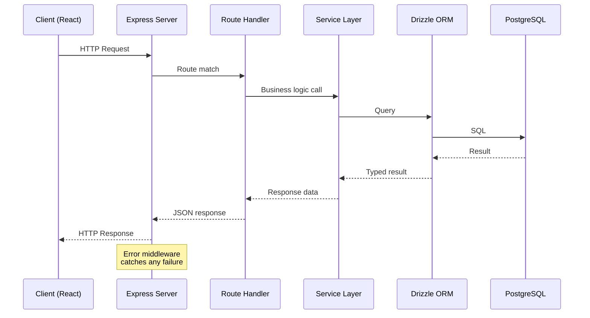
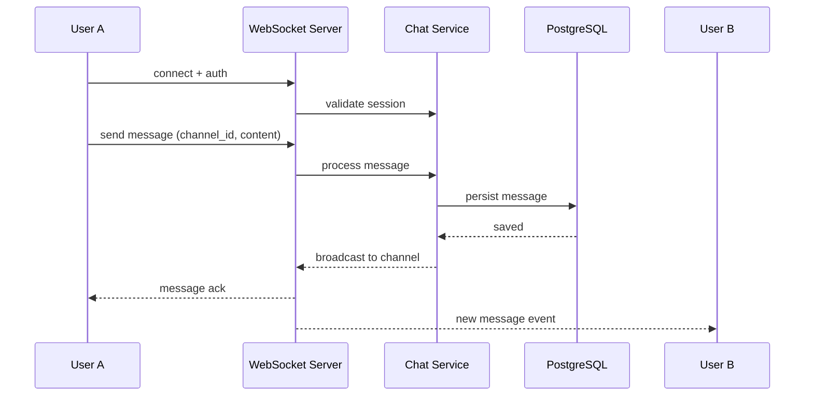
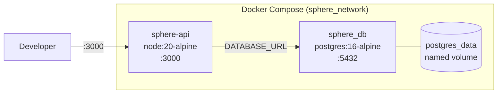
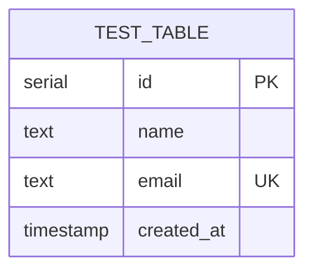
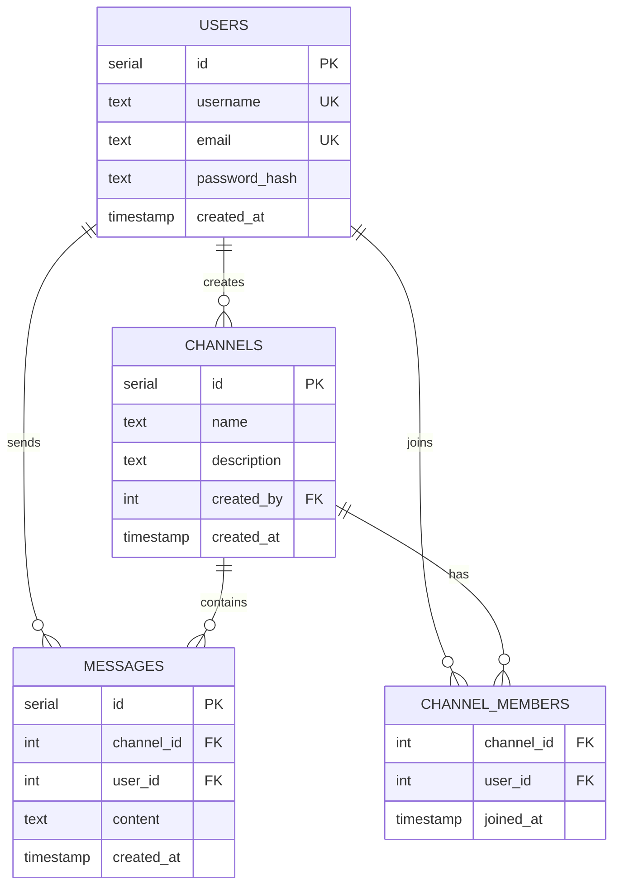
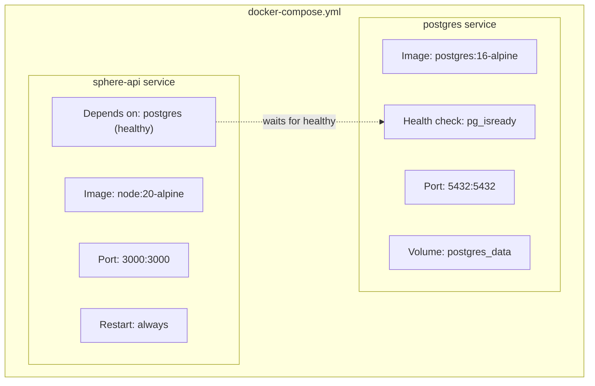
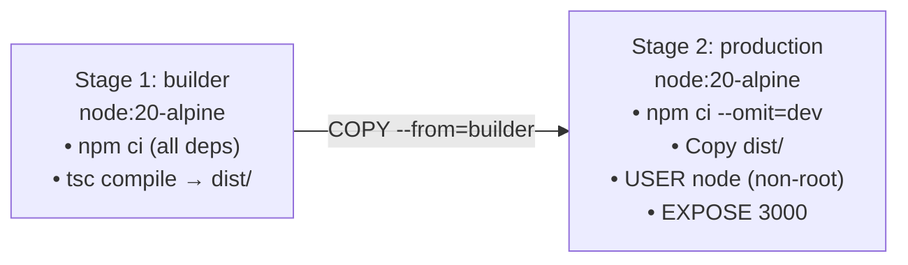
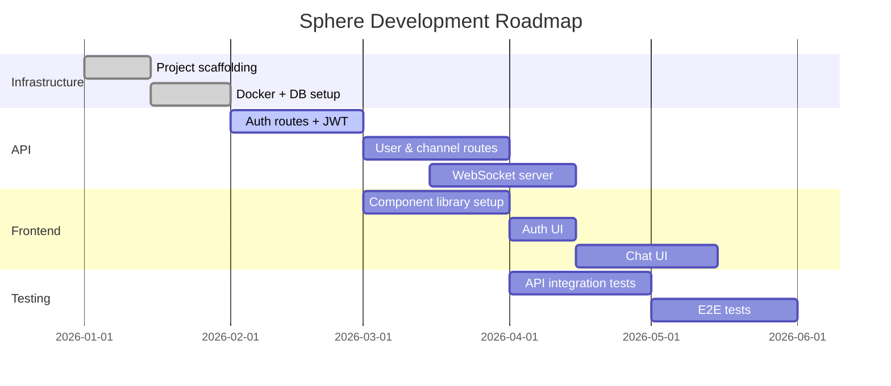

# Sphere

> A community-driven, real-time social chat application built with a modern full-stack TypeScript architecture.

---

## Table of Contents

- [Overview](#overview)
- [Architecture](#architecture)
- [Tech Stack](#tech-stack)
- [Project Structure](#project-structure)
- [Data Model](#data-model)
- [Infrastructure](#infrastructure)
- [Development Setup](#development-setup)
- [Scripts](#scripts)
- [Roadmap](#roadmap)

---

## Overview

Sphere is a real-time group chat platform designed for community interaction. It provides WebSocket-based messaging, user management, and channel-based conversations at its core.

**Current Status:** Early development — infrastructure, database layer, and server scaffolding are complete. API routes, services, and frontend components are pending.

---

## Architecture

### System Architecture



---

### Request Lifecycle



---

### WebSocket Flow (Planned)



---

### Deployment Architecture



---

## Tech Stack

| Layer | Technology | Version |
|---|---|---|
| Frontend Framework | React | 19.2.0 |
| Frontend Build | Vite | 7.3.1 |
| Frontend Language | TypeScript | 5.9.3 |
| React Compiler | Babel Plugin (React Compiler) | enabled |
| Backend Framework | Express | 5.2.1 |
| Backend Language | TypeScript | 5.9.3 |
| Backend Runtime | Node.js | 20 (Alpine) |
| ORM | Drizzle ORM | 0.45.1 |
| Database | PostgreSQL | 16 |
| Containerization | Docker + Docker Compose | - |
| Code Quality | ESLint + Prettier | - |

---

## Project Structure

```
sphere/
├── api/                        # Backend Express API
│   ├── src/
│   │   ├── app.ts              # Express app initialization
│   │   ├── server.ts           # HTTP server entry point
│   │   ├── config/
│   │   │   └── serverConfig.ts # Port, env config via dotenv
│   │   ├── db/
│   │   │   ├── index.ts        # Drizzle + pg connection pool
│   │   │   ├── schema.ts       # Table definitions (Drizzle ORM)
│   │   │   └── migrations/     # Auto-generated SQL migrations
│   │   ├── middleware/
│   │   │   └── errorHandler.ts # Global error formatting
│   │   ├── types/
│   │   │   └── config.d.ts     # SERVER_Config interface
│   │   ├── routes/             # [pending] API route handlers
│   │   ├── services/           # [pending] Business logic
│   │   └── websocket/          # [pending] WS server setup
│   ├── Dockerfile              # Multi-stage build (builder → prod)
│   ├── docker-compose.yml      # API + PostgreSQL orchestration
│   └── drizzle.config.ts       # ORM config (schema, migrations)
│
├── ui/                         # Frontend React app
│   ├── src/
│   │   ├── main.tsx            # React root render
│   │   └── App.tsx             # Root component
│   ├── index.html              # SPA shell
│   └── vite.config.ts          # Vite + React Compiler config
│
├── LICENSE                     # MIT
└── README.md
```

---

## Data Model

### Current Schema



> The `test` table is a placeholder. The production schema (planned) will include:

### Planned Schema



---

## Infrastructure

### Docker Setup



### Multi-Stage Dockerfile



---

## Development Setup

### Prerequisites

- Node.js 20+
- Docker + Docker Compose
- npm

### Running with Docker

```bash
cd api
docker-compose up --build
```

This starts:
- API server at `http://localhost:3000`
- PostgreSQL at `localhost:5432`

### Running Locally

**API:**
```bash
cd api
npm install
cp .env.example .env        # set DATABASE_URL
npm run dev
```

**UI:**
```bash
cd ui
npm install
npm run dev
```

---

## Scripts

### API (`api/`)

| Script | Description |
|---|---|
| `npm run dev` | Hot-reload dev server via nodemon |
| `npm run build` | Compile TypeScript → `dist/` |
| `npm start` | Run compiled production build |
| `npm run lint` | ESLint check |
| `npm run lint:fix` | Auto-fix lint issues |
| `npm run db:generate` | Generate migrations from schema |
| `npm run db:migrate` | Apply migrations |
| `npm run db:push` | Push schema directly to DB |
| `npm run db:studio` | Launch Drizzle Studio (DB GUI) |

### UI (`ui/`)

| Script | Description |
|---|---|
| `npm run dev` | Vite dev server with HMR |
| `npm run build` | Type-check + production build |
| `npm run preview` | Preview production build |
| `npm run lint` | ESLint check |

---

## Roadmap



---

## License

MIT © 2026 Sahil Verma
